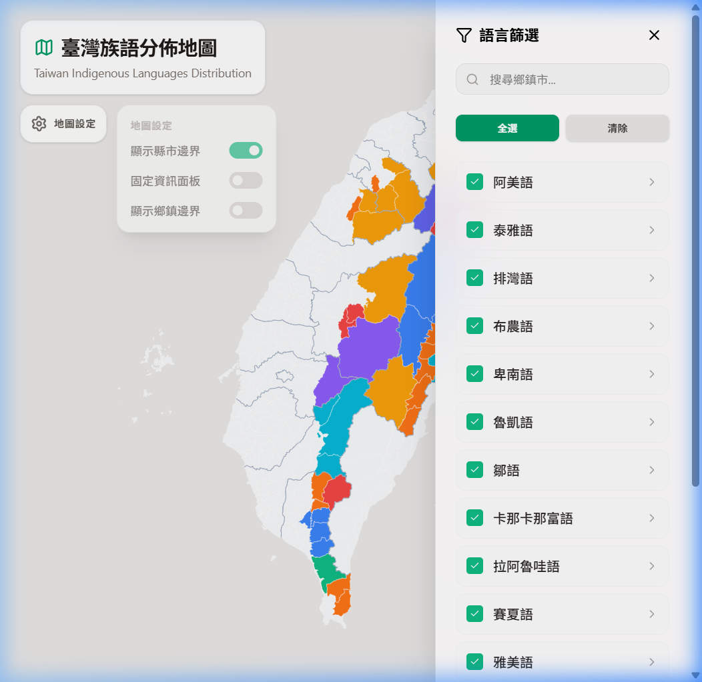

<div align="center">
  
</div>

# Taiwan Yincumin Map (臺灣族語分佈地圖)

An interactive map application showcasing the geographical distribution of Taiwan's indigenous languages and dialects. 

## Features

- **Interactive Map**: Built with React, D3.js and TopoJSON.
- **Language Filtering**: Explore and highlight specific languages and dialects.
- **Search**: Quickly find specific towns and their corresponding languages.
- **Detailed Tooltips**: Hover over regions to see which dialects are spoken there.
- **Customizable UI**: Toggle county/township borders and floating or fixed info panels.

## Run Locally

**Prerequisites:** Node.js

1. Install dependencies:
   ```bash
   npm install
   ```
2. Start the development server:
   ```bash
   npm run dev
   ```
